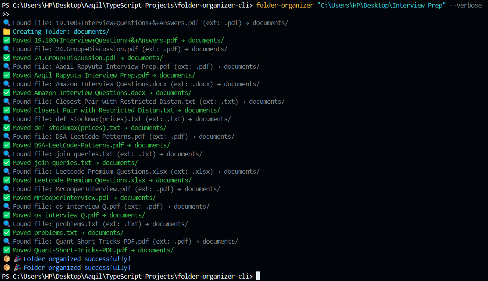

# 📁 folder-organizer

[](https://www.npmjs.com/package/folder-organizer)
[](https://www.npmjs.com/package/folder-organizer)
[](https://opensource.org/licenses/MIT)

A simple CLI tool to automatically organize files in a folder based on their extensions — built with TypeScript.

---

## ✨ Features

- 📦 Organizes files into folders like `Images/`, `Documents/`, `Videos/`, etc.
- 🔍 Scans a given folder path
- 🪄 Creates directories if they don't exist
- 🗃️ Moves files based on common extensions
- 🧑‍💻 Written in TypeScript, bundled with `tsup`

---

## 🚀 Installation

### Globally via NPM:

```bash
npm install -g folder-organizer
```

#### Or use it directly without installing

```bash
npx folder-organizer <path-to-folder>
```

---

#### 🛠️ Command-line Options

| Flag        | Description                                                           |
| ----------- | --------------------------------------------------------------------- |
| `--verbose` | Enables detailed logs of the file organization process.               |
| `--dry-run` | Simulates the organization process without actually moving any files. |

##### 🛠️ Usage

```bash
folder-organizer <path-to-folder>
```

```bash
# Organize with detailed logs
folder-organizer /path/to/your/folder --verbose
```

```bash
# Preview actions without actually moving files
folder-organizer /path/to/your/folder --dry-run
```

```bash
# Combine both
folder-organizer /path/to/your/folder --verbose --dry-run
```

###### Example

```bash
folder-organizer <path-to-folder>
```



---


